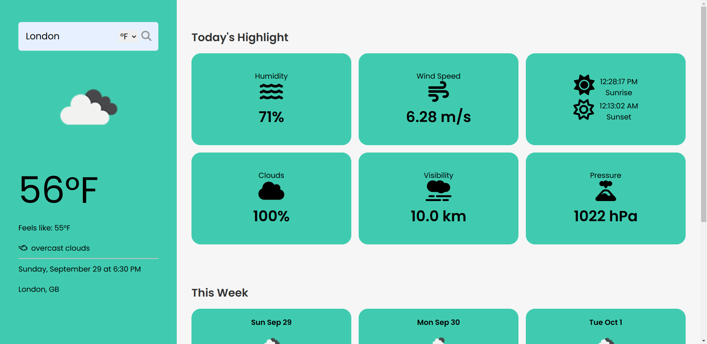

Here’s a complete README for your Weather App project, incorporating emojis and a well-structured format:

---

# Weather App 🌤️

## Overview

Welcome to the **Weather App**! This is a **responsive** web application built using **HTML**, **CSS**, and **JavaScript**. It allows users to search for the current weather conditions in any city worldwide. The app fetches real-time weather data from the **OpenWeatherMap API** and displays details like temperature, humidity, wind speed, and weather conditions with icons. The design is fully responsive, providing an optimized user experience on desktops, tablets, and mobile devices.

---

## Screenshots


*Weather Details - Displaying current weather conditions*

---

## Live Demo

You can try out the live version of the Weather App here: [Live Demo](https://surya-kf.github.io/WeatherApp/)

---

## Key Features

- **🔍 Search Functionality**: Search for any city and get real-time weather updates.
- **🌡️ Weather Details**: Displays current temperature, weather conditions, wind speed, and humidity.
- **🌈 Dynamic Background**: Changes background based on weather conditions (e.g., sunny, rainy).
- **📱 Responsive Design**: Fully optimized for different screen sizes, including mobile devices.
- **⚠️ Error Handling**: Provides user-friendly messages for invalid city searches or API errors.

## Technologies Used

- **HTML5**: For structuring the content.
- **CSS3**: For styling the app, including responsiveness using media queries.
- **JavaScript (ES6)**: For fetching data from the weather API and dynamically updating the UI.
- **OpenWeatherMap API**: To get real-time weather information.

---

## Features Breakdown

1. **Search for Weather**:
   - Users can search by city name to get current weather data.
   - The app fetches data from the OpenWeatherMap API.

2. **Real-Time Weather Display**:
   - Displays weather information, including:
     - Temperature (in Celsius or Fahrenheit)
     - Weather conditions (with an appropriate icon)
     - Humidity and wind speed

3. **Dynamic Background**:
   - The background changes depending on the weather conditions (e.g., sunny, cloudy, rainy).

4. **Responsive Design**:
   - Works seamlessly across devices (desktop, tablet, and mobile).
   - The layout adapts using CSS media queries for various screen sizes.

5. **Error Handling**:
   - Provides informative error messages if the city name is invalid or the API fails to fetch data.

---

## Installation and Setup

To run this project locally, follow these steps:

1. **Clone the repository**:
   ```bash
   git clone https://github.com/Surya-KF/WeatherApp.git
   cd WeatherApp
   ```

2. **Open the Project**:
   - Open the `index.html` file in your browser.

3. **API Setup**:
   - Create an account on [OpenWeatherMap](https://openweathermap.org/) and get an API key.
   - In the `script.js` file, replace the placeholder `YOUR_API_KEY` with your OpenWeatherMap API key.

4. **Run the App**:
   - Once the API key is set, you can run the app directly by opening the `index.html` file in any web browser.

---

## File Structure

```
weather-app/
├── css/
│   └── styles.css          # CSS file for styling the app
├── js/
│   └── script.js           # JavaScript file for fetching weather data
├── index.html              # Main HTML file
└── README.md               # Project documentation
```

---

## Usage

1. **🔍 Search for a City**:
   - Type the name of the city in the search bar and hit enter or click the search button.

2. **🌦️ View Weather Data**:
   - The weather details for the searched city will be displayed with temperature, conditions, wind speed, and more.

---

## Future Enhancements

- **📅 Weather Forecast**: Add a 5-day weather forecast feature.
- **🌍 Geolocation**: Automatically detect the user's current location and display local weather.
- **⚖️ Unit Conversion**: Provide an option to switch between Celsius and Fahrenheit.
- **✨ Improved UI**: Add more weather animations for better visual representation.

---

## Contributing

If you'd like to contribute to this project, feel free to open an issue or submit a pull request. Contributions are always welcome! 🤗

---

## License

This project is licensed under the MIT License. 📝

---
